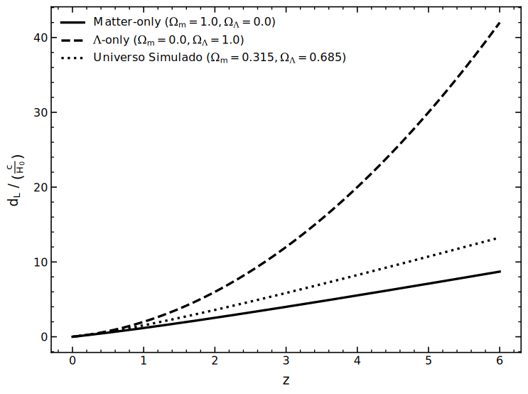
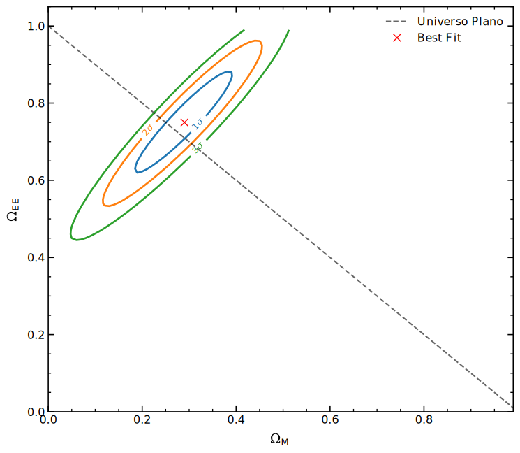

# HoggCosmoMeasures


Este repositório contém um integrador numérico desenvolvido em Python para o cálculo da Distância de Luminosidade ($d_L$) dentro do formalismo de Hogg e modelos cosmológicos de Friedmann-Lemaître-Robertson-Walker (FLRW). Além disso, o projeto inclui um conjunto de ferramentas completas de inferência estatística, permitindo não só a superposição de universos teóricos, mas também o ajuste de parâmetros cosmológicos a partir de dados observacionais de Supernovas do Tipo Ia (SNe Ia).

## Autoria

**Victor Moreira Acacio**

Instituto de Astronomia, Geofísica e Ciências Atmosféricas da Universidade de São Paulo (IAG-USP)

GitHub: [@OAkacio](https://github.com/OAkacio)

ORCID: [0009-0007-4484-2129](https://orcid.org/0009-0007-4484-2129)

## Instalação

Clone este repositório e instale as dependências executando os seguintes comandos no seu terminal:

```bash
git clone https://github.com/OAkacio/flrw-luminosity-distance-integrator.git
cd flrw-luminosity-distance-integrator
pip install -r requirements.txt
```

## Uso

O código foi projetado de forma modular. Você pode ajustar os parâmetros de entrada, realizar integrações pontuais, executar varreduras estatísticas e gerar gráficos de alta qualidade através de scripts específicos.

Um Jupyter Notebook dentro dos arquivos foi projetado para facilitar o uso de códigos de forma independente.

**1. Configuração de Parâmetros:** Antes de executar o integrador ou a análise, defina seus parâmetros cosmológicos ($\Omega_m$, $\Omega_{EE}$, $w$, $z$ e o _prior da CMB_) em _src/parameters.py_. Constantes físicas podem ser modificadas em _src/constants.py_.

**2. Geração de Dados Teóricos (Modelo Único):** Para rodar a rotina de integração numérica do seu modelo customizado e exportar os resultados em arquivos _.txt_ na pasta _data/_, execute:

```bash
python main.py
```

**3. Gráficos Básicos e Analíticos:** Com os dados numéricos gerados, plote as curvas individuais para a Distância de Luminosidade, Módulo de Distância e o Erro de Aproximação (Exato vs. Série de Taylor) rodando:

```bash
python single_universe_plots.py
```

**4. Superposição e Comparação de Modelos:** Para integrar automaticamente cenários distintos (Universo Customizado, Apenas Matéria e Apenas Energia Escura) e plotar suas respectivas curvas em um mesmo painel visual, utilize:

```bash
python comparison_plots.py
```



**5. Inferência Estatística Observacional:** Para ajustar modelos aos dados de supernovas (_obs_data.txt_), calculando a matriz de $\chi^2$ via força bruta, traçando os contornos de confiança (elipses de erro a 1 $\sigma$, 2 $\sigma$ e 3 $\sigma$) e extraindo as probabilidades de expansão acelerada, execute:

```bash
python observational_statistical_analysis.py
```



**6. Demonstração Interativa:** Para uma exploração guiada dos modelos, testes de integração e visualização estatística, um Jupyter Notebook está disponível. Execute-o via terminal com:

```bash
jupyter notebook notebooks/demonstration.ipynb
```

## Fundamentação Teórica e Estatística

A base matemática apoia-se nas definições cosmológicas clássicas para um universo homogêneo e isotrópico. A rotina processa as seguintes grandezas em cascata:

**1. Função de Expansão de Hubble ($E(z)$):** Descreve a evolução temporal da taxa de expansão em função da densidade de matéria ($\Omega_m$), curvatura espacial ($\Omega_k$), energia escura ($\Omega_{EE}$) e seu parâmetro de estado $w$:

$$E(z) = \sqrt{\Omega_m(1+z)^3 + \Omega_k(1+z)^2 + \Omega_{EE}(1+z)^{3(1+w)}}$$

**2. Distância Comóvel Radial ($D_C$):** É a coordenada central do nosso integrador, representando a distância no tempo de olhar para trás (lookback time) na linha de visada:

$$D_C = \frac{c}{H_0} \int_0^z \frac{dz'}{E(z')}$$

**3. Distância Comóvel Transversal ($D_M$):** Inclui os efeitos da geometria global. Utilizando a distância de Hubble $D_H = c/H_0$ e a relação $\Omega_k = 1 - \Omega_m - \Omega_{EE}$:

$$D_M = \begin{cases} \frac{D_H}{\sqrt{\Omega_k}} \sinh\left(\sqrt{\Omega_k} \frac{D_C}{D_H}\right) & \text{se } \Omega_k > 0 \text{ (Universo Aberto)} \\ D_C & \text{se } \Omega_k = 0 \text{ (Universo Plano)} \\ \frac{D_H}{\sqrt{|\Omega_k|}} \sin\left(\sqrt{|\Omega_k|} \frac{D_C}{D_H}\right) & \text{se } \Omega_k < 0 \text{ (Universo Fechado)} \end{cases}$$

**4. Distância de Luminosidade ($D_L$) e Módulo de Distância ($\mu$)** Conecta o fluxo fotônico recebido à luminosidade intrínseca da vela padrão:

$$D_L = (1+z) D_M$$

A conversão logarítmica resulta no Módulo de Distância ($\mu$), nossa principal observável:

$$\mu = 5 \log_{10}\left(D_L\right) + 25$$

**5. Inferência de Parâmetros e Maximização da Verossimilhança ($\chi^2$)** Para adequar a teoria aos dados, o código computa o qui-quadrado sobre os erros observacionais gaussianos ($\sigma_{\mu_i}$):

$$\chi^2 = \sum_{i} \frac{[\mu_{obs}(z_i) - \mu_{teo}(z_i, \Omega_M, \Omega_{EE}, w)]^2}{\sigma_{\mu_i}^2}$$

Os intervalos de confiança são construídos assumindo que a densidade de probabilidade distribui-se como $P \propto \exp(-\chi^2/2)$. O conjunto de análise também suporta quebra de degenerescência adicionando termos de *prior*, como o limite da Radiação Cósmica de Fundo (CMB).

## Estrutura do Projeto:

```bash

├── data/                  # Arquivos exportados de dados numéricos (.txt)
├── figures/               # Gráficos de saída em alta qualidade (.pdf, .svg)
├── notebooks/             # Ambiente interativo de testes e demonstração
│   ├── data/
│   ├── figures/
│   └── demonstration.ipynb
├── src/                   # Código-fonte e bibliotecas do núcleo
│   ├── constants.py       # Constantes físicas e resolução de malhas iterativas
│   ├── core.py            # Equações teóricas e funções de estatística bayesiana
│   ├── parameters.py      # Inputs cosmológicos e limites de inferência
│   ├── plot.py            # Customização visual para publicação (formatação LaTeX)
│   └── save_load.py       # Rotinas de I/O para geração local de dados
├── comparison_plots.py                   # Renderiza a superposição de distâncias teóricas
├── main.py                               # Motor numérico isolado para cálculo de distâncias
├── observational_statistical_analysis.py # Suíte completa para a varredura do qui-quadrado
├── single_universe_plots.py              # Renderiza comportamento numérico de um modelo único
├── obs_data.txt           # Input dos dados observacionais (catálogo de Supernovas Ia)
└── requirements.txt       # Arquivo de dependências

```

## Motivação

Este repositório foi construído no escopo da disciplina Cosmologia do Bacharelado em Astronomia (IAG-USP), buscando investigar o tratamento observacional de SNe Ia como velas-padrão. O foco migra da formulação reprodutível de distâncias para a constrição observacional de parâmetros como aceleração cósmica. A estruturação orienta-se aos princípios da Ciência Aberta, garantindo flexibilidade a outros estudantes e pesquisadores.

## Referências

* HOGG, David W. **Distance measures in cosmology**. 1999. Disponível em: https://arxiv.org/abs/astro-ph/9905116.
* COE, Dan. **Fisher Matrices and Confidence Ellipses: A Quick-Start Guide and Software**. 2009. Disponível em: https://arxiv.org/abs/0906.4123.
